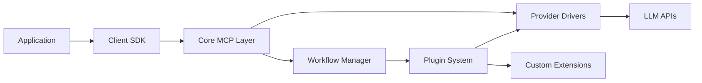

# Architecture Overview

The OmniXy architecture is designed to be modular and extensible, allowing seamless integration with various LLM providers while adhering to the Model Context Protocol (MCP).

## Components

1. **Core MCP Layer**
   - Manages the protocol logic: request/response formatting, partial token streaming, context management
   - Offers a minimal interface for sending `MCPRequest` objects and receiving `MCPResponse` objects
   - Handles token counting, rate limiting, and error handling

2. **Provider/Driver Layer**
   - Each provider (Gemini, OpenAI, Cohere, local LLM) has a "driver" implementing a well-defined interface
   - Translates generic MCP requests into provider-specific API calls
   - Processes provider responses into the MCP structure

   ```python
   class LLMProviderDriver:
       def send_request(self, mcp_request: MCPRequest) -> MCPResponse:
           ...
       def stream_tokens(self, mcp_request: MCPRequest) -> Iterator[MCPPartialResponse]:
           ...
       def validate_request(self, mcp_request: MCPRequest) -> bool:
           ...
   ```

3. **Workflow Manager**
   - Manages complex multi-step LLM interactions
   - Supports sequential, parallel, and hybrid workflows
   - Handles workflow state management and persistence
   - Provides error handling and retry mechanisms

4. **Plugin System**
   - Enables extensibility through custom plugins
   - Supports different plugin types (processors, providers, workflows)
   - Manages plugin lifecycle and dependencies
   - Provides isolation and error containment

5. **Orchestration & Reasoning Layer**
   - Implements chain-of-thought and multi-step reasoning
   - Maintains conversation states and contexts
   - Manages token windows and context pruning
   - Supports different reasoning strategies

## Data Flow



## Testing Architecture

1. **Unit Tests**
   - Test individual components in isolation
   - Mock external dependencies
   - Focus on edge cases and error handling

2. **Integration Tests**
   - Test component interactions
   - Verify workflow execution
   - Test plugin integration

3. **Provider Tests**
   - Test each LLM provider integration
   - Verify token streaming
   - Check error handling

4. **Performance Tests**
   - Monitor response times
   - Track token usage
   - Measure resource utilization

## Security Architecture

1. **Authentication**
   - Secure API key management
   - Provider credential handling
   - Plugin authentication

2. **Data Protection**
   - Request/response encryption
   - PII handling
   - Audit logging

3. **Plugin Security**
   - Sandbox execution
   - Resource limits
   - Code verification
