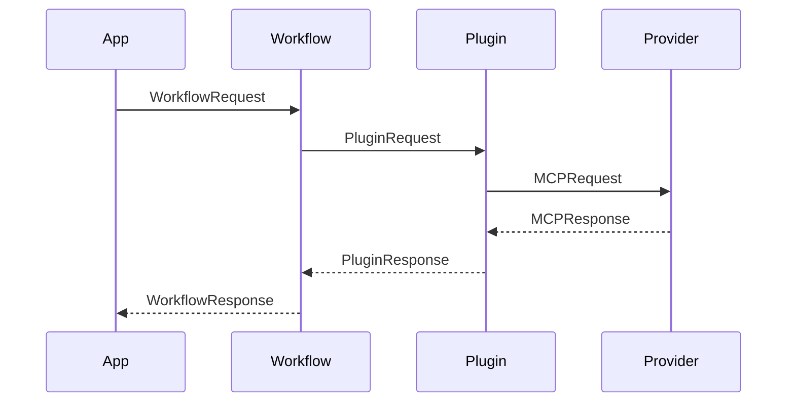

# Model Context Protocol (MCP)

This document outlines the message structures used for communication within the OmniXy system, adhering to the Model Context Protocol (MCP).

## Core Message Objects

### MCPRequest

- Defines the prompt or message to send
- Key attributes:

  ```python
  class MCPRequest:
      model: str  # Name of the LLM (e.g., "gpt-4", "gemini-pro")
      messages: List[Dict]  # List of role-based messages
      context: Optional[Dict]  # Context from previous steps
      parameters: Dict  # Model-specific parameters
      metadata: Dict  # Request metadata
      plugin_data: Optional[Dict]  # Plugin-specific data
  ```

### MCPResponse

- Contains the LLM's completion and metadata
- Key attributes:

  ```python
  class MCPResponse:
      text: str  # Completed text from LLM
      metadata: Dict  # Response metadata
          tokens_used: int
          timestamp: datetime
          model: str
          provider: str
      error: Optional[Dict]  # Error information if present
      plugin_data: Optional[Dict]  # Plugin-specific data
  ```

### MCPPartialResponse

- For streaming token-based responses
- Key attributes:

  ```python
  class MCPPartialResponse:
      partial_text: str  # Partial completion
      is_final: bool  # Whether this is the final chunk
      metadata: Dict  # Partial response metadata
      error: Optional[Dict]  # Error information if present
  ```

## Workflow Message Objects

### WorkflowRequest

- Defines a workflow execution request
- Key attributes:

  ```python
  class WorkflowRequest:
      workflow_id: str  # Unique workflow identifier
      steps: List[Dict]  # List of workflow steps
      config: Dict  # Workflow configuration
      context: Dict  # Workflow context
      metadata: Dict  # Workflow metadata
  ```

### WorkflowResponse

- Contains workflow execution results
- Key attributes:

  ```python
  class WorkflowResponse:
      workflow_id: str  # Workflow identifier
      status: str  # Workflow status
      step_results: List[Dict]  # Results from each step
      errors: List[Dict]  # Any errors encountered
      metadata: Dict  # Execution metadata
  ```

### WorkflowStepResult

- Results from a single workflow step
- Key attributes:

  ```python
  class WorkflowStepResult:
      step_id: str  # Step identifier
      status: str  # Step status
      result: Any  # Step execution result
      error: Optional[Dict]  # Error if step failed
      metadata: Dict  # Step execution metadata
  ```

## Plugin Message Objects

### PluginRequest

- Request to a plugin
- Key attributes:

  ```python
  class PluginRequest:
      plugin_id: str  # Plugin identifier
      action: str  # Action to perform
      parameters: Dict  # Action parameters
      context: Dict  # Plugin context
  ```

### PluginResponse

- Response from a plugin
- Key attributes:

  ```python
  class PluginResponse:
      plugin_id: str  # Plugin identifier
      status: str  # Execution status
      result: Any  # Action result
      error: Optional[Dict]  # Error information
      metadata: Dict  # Plugin metadata
  ```

## Context Management

### Chain-of-Thought Context

- Maintain context store in memory/Redis/database
- Support context windowing and pruning
- Configurable visibility modes:
  - `visible`: For debugging/advanced usage
  - `hidden`: For provider compliance

### Workflow Context

- Persistent workflow state storage
- Cross-step data sharing
- Support for parallel execution contexts

### Plugin Context

- Plugin-specific state management
- Cross-plugin communication
- Secure context isolation

## Message Flow



## Best Practices

1. **Message Validation**
   - Validate all message attributes
   - Check type constraints
   - Verify required fields

2. **Error Handling**
   - Use structured error objects
   - Include error context
   - Support error recovery

3. **Context Management**
   - Implement proper cleanup
   - Handle context limits
   - Secure sensitive data
